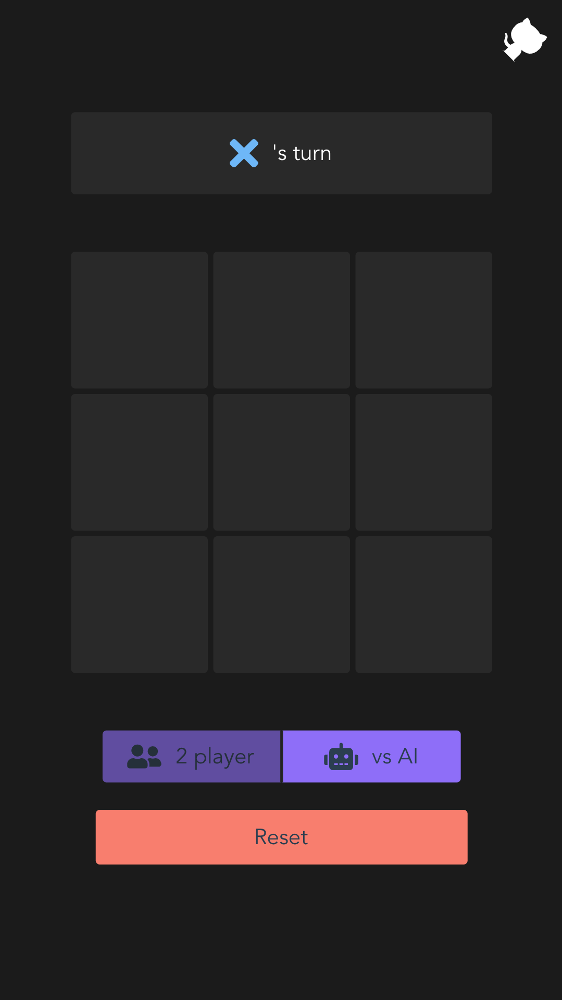

# CityJS Workshop - Tic Tac Toe app

This is what you'll be building:

<p align="center">
  
</p>

Hello, welcome! This is the "Build your own Serverless tic tac toe AI using Node.js and (a little bit of) TensorFlow.js" Workshop. I hope you are in the right place! 

First off let's introduce ourselves:

Hew - Javascript Pirate...

Thomas - Javascript Ninja...

Over the next 2.5 hours, we will help you learn about serverless functions, good use cases of them, and bad ones! We will also show you how easy it is to build, test, and deploy them.

## Prerequisites
If you need any help with the prerequisites send either of us a message and we will try help out.

  * 1 laptop
  * node.js and git installed.
  * 1 GitHub account
  * Some basic Javascript knowledge
  * Over 9000 patience for silliness

## Introduction

Our goal is to help you get a basic understanding of Serverless, otherwise known as Functions As A Service. We hope to do this by working through an examples together for a use case that doesnt really make sense but Hew it made work anyway (what a hero). 

The application is made in Vue.JS it's an aproachable and blazing fast framework for building applications in JavaScript. A little bit of javascript is all you will need to get through the workshop, but if you want to learn more have a look through the [documentation](https://vuejs.org/v2/guide/). Its fantastic!

We will be deploying the application to [Netlify](https://www.netlify.com/) it's a great platform for hosting and deploying websites and it links together very nicely with source control. Best of all it is free for small projects like this. We totaly did not get paid to say this but @netlify if you are listening? ;)

We will also use netlify functions, these are a quick easy way to deploy a serverless function to AWS. 


## The Challenges

* Building a serverless function that responds with the best next move. (We have some helpful code snippets to help with this one, if you have any suggestions to improve them let us know)

* Write an api test that checks the function works as intended.

* Wire up the function to the front end and enable AI mode!

* Create a test that checks switching between AI and PVP works.

## Getting started

The following steps will get you up and running.

 - You'll need to have [node.js](https://nodejs.org/en/) installed
 - [Git](https://git-scm.com/) installed
 - [Yarn](https://yarnpkg.com/en/)

 
1. Fork your own copy of the lnug/CityJS-Workshop-Starter to your account.
2. Go to [Netlify](https://www.netlify.com/) and sign up.
3. Click New Site from Git.
4. Pick the CityJS-Workshop repository and Click Deploy.
5. clone a local copy of the repository
6. Run the application with `yarn run serve`

#### Netlify
Netlify is a super easy platform for building, deploying, and serving sweet modern web apps. It'll host a single page app statically and serve up the backend as serverless functions - super scalable, super cheap and super great.


The netlify.toml file describes how the site should be deployed
```
[Settings]
ID = "Your_Site_ID"
[build]
  base = ""
  publish = "dist"
  functions = "functions/"
  command = "npm run build"
```
The base directory is the starting point where netlify looks for a file that shows how your project is configured. i.e. a package.json. It will also install any dependencies for you. All files in the publish directory get deployed to netlifys CDN.

All js files in the funcion directory get deployed as an aws lamda accessable on `/.netlify/<name_of_folder>/<name_of_file>`


## Building the app

To start with the app works as a 2 player Tic Tac Toe game, all the functionality is in the frontend.

### Step 1 - Adding an endpoint

Endpoints are built from the `src_functions` directory. Make a new file in `src_functions` with `touch test.js`. Netlify will process this into an endpoint called `/test` and calling the endpoint will trigger the function in `test.js/handler`.
So
```
exports.handler = function(event, context, callback) {
    console.log('hello world')
}
```
Will log 'hello world' to the console every time the endpoint is hit. It'll also not return anything and timeout so... not great.

Instead we need to provide a proper callback and return a nice response. The function below will log out the string and return a 200 with the text as well.

```
exports.handler = function(event, context, callback) {
    console.log('hello world')
    callback(null, {
    statusCode: 200,
    body: "Hello, World"
    });
}
```
Want to take input from a post request and do stuff in the function? Easy

```
exports.handler = function(event, context, callback) {
    const string = event.body
    callback(null, {
    statusCode: 200,
    body: `Hello, ${string}`
    });
}
```

### Step 2 - Making the endpoint do something actually useful

The frontend stores the board as an array of length 9:
0 denotes an empty field
1 is an 'x'
-1 is an 'o'

So the board:

would be represented by the array 
`[0, 1, 0, 1, -1, -1, 0, 0, -1]`

So... lets try to make the endpoint take the board and return the 'next move'. Lets start with just playing the move in the first available space on the board.
So for `[0, 1, 0, 1, -1, -1, 0, 0, -1]` we want to return 0 (the first empty board position)


### Step 3 - Training a neural net

So we're going to use brain.js for our neural net. Why? It's simple.

To train your net you just pass in the training data to the `net.train()` function. The training data needs to be of the form:
```
[{input: [], output: []}, {input: [], output: []}, {input: [], output: []}, ...]
```
We have a couple of options for training data. This super-useful resource from Connelly Barnes gives us some: http://www.connellybarnes.com/work/class/2016/deep_learning_graphics/proj1/

There are 2 data sets:
[Single label intermediate boards of optimal plays](http://www.connellybarnes.com/work/class/2016/deep_learning_graphics/proj1/tictac_single.txt)
[Multi label intermediate boards of optimal plays](http://www.connellybarnes.com/work/class/2016/deep_learning_graphics/proj1/tictac_multi.txt)

Process it into something the neural net can actually use and... give it a go. Brain.js lets us output the model as JSON or function. Functions are cool so lets save the trained model as a function into a separate js file we can use.

```
const net = new brain.NeuralNetwork(config);
net.train(betterData);

fs.writeFileSync('trained-net.js', `export default ${ net.toFunction().toString() };`);
```

### Step 4 - Using the neural net

Using your trained neural net is super simple.
Import it `import trainedNet from './neuralNet/trained-net'`
and then call it `const result = trainedNet(board)`. This will return a value of the shape of the outputs you put into it. So we can now turn our endpoint that gave us a fake 'next move' into a more useful one...


### Step 5 - Wiring the frontend up to the endpoint

